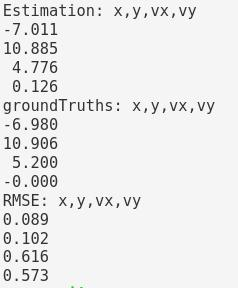

# Overview
In this repository, I implemented an Unscented Kalman Filter to track a moving object based on radar measurements and lidar measurements. The Root Mean Square Error (RMSE) was adopted to measure the estimation error.

The state of the object: (x, y, v, yaw, yawRate)  
Radar measurement: (rho, phi, rho_dot)  
Lidar measurement: (x, y)

## Sensor measurements 
The `./data/obj_pose-laser-radar-synthetic-input.txt` file contains synthetic sensor measurements and the corresponding ground truth. Each line represent a measurement.

For a radar meaurement, the line includes `sensor_type, rho_measured, phi_measured, rhodot_measured, timestamp, x_groundtruth, y_groundtruth, vx_groundtruth, vy_groundtruth, yaw_groundtruth, yawrate_groundtruth`.

For a lidar measurement, the line includes `sensor_type, x_measured, y_measured, timestamp, x_groundtruth, y_groundtruth, vx_groundtruth, vy_groundtruth, yaw_groundtruth, yawrate_groundtruth`.

## Requirements
Ubuntu:
```
cmake >= 3.5
gcc/g++ >= 5.4
make >= 4.1
```
## How to build and run this program

 ```
 mkdir build
 cd build
 cmake ..
 make
 ./UnscentedKF ../data/obj_pose-laser-radar-synthetic-input.txt 
 ```

 A screenshot of the final output is shown as follows:

 

## Unit test
Currently I have not tested the project yet, but I plan to test it with Google Test in the future.
